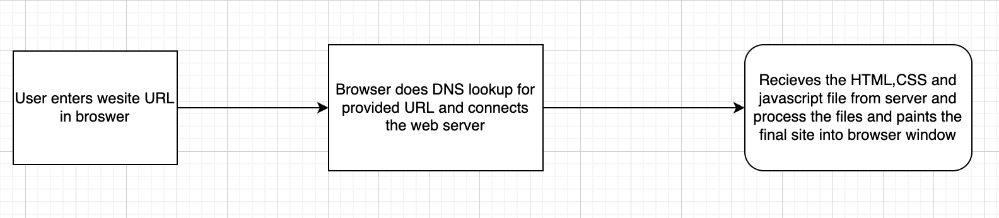
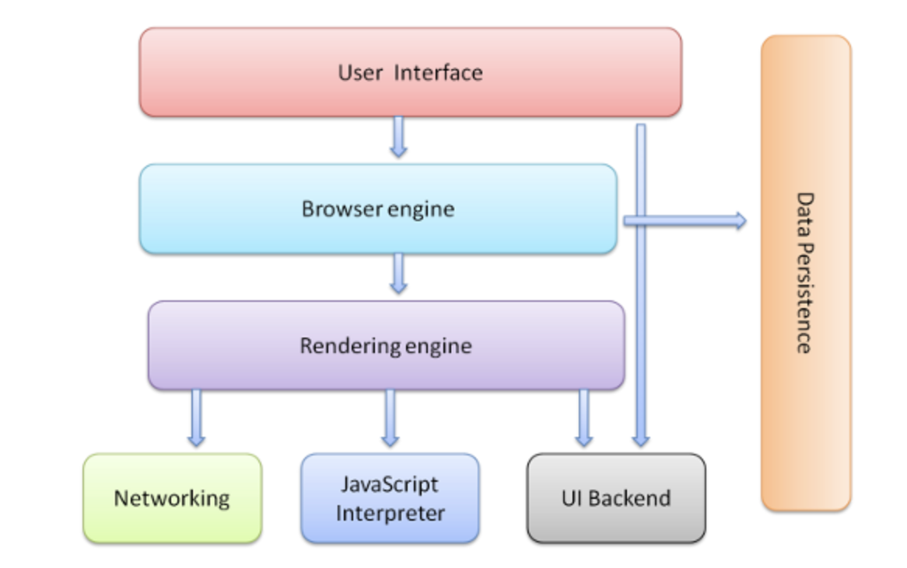
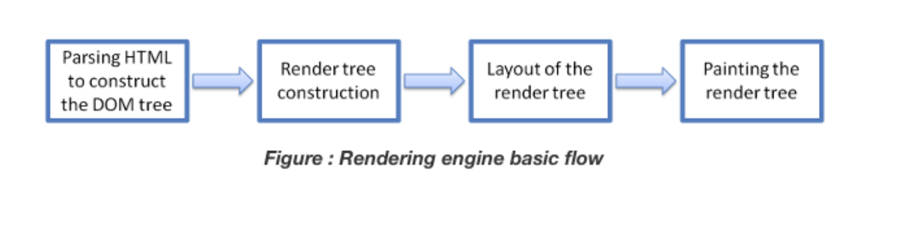
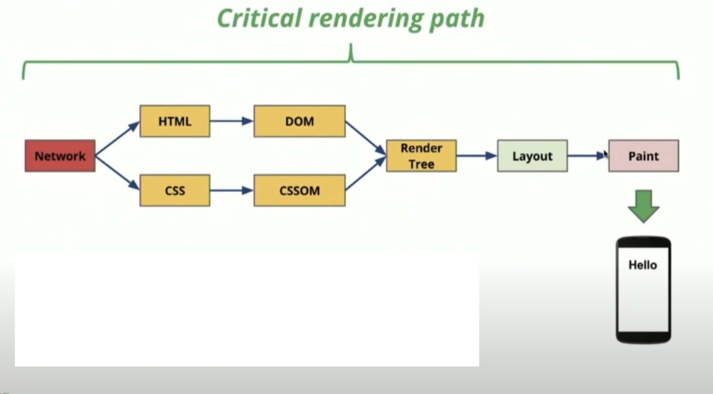

# Assignment 1

## 1. What is the main functionality of the browser?

Browser’s main function is to source the webpage requested from the web server and render it in the Browser window. The webpage displayed is usually an HTML document with CSS. Browser has other functionality such as bookmarking, moving backward and forward

## 2. High Level Components of a browser.

Browser majorly comprises of 7 components they are:

**1. The user interface:** This is where user views the requested web page  and also  includes some common UI elements such as the address bar, back/forward button, bookmarking menu, etc.

**2. The browser engine:** facilitates  actions between the UI and the rendering engine.

**3. The rendering engine :** responsible for displaying requested content. For example if the requested content is HTML, the rendering engine parses HTML and CSS, and displays the parsed content on the screen.(we would see how the HTML and CSS are resendred later in critical render path)

**4. Networking:** for network calls such as HTTP requests, using different implementations for different platforms behind a platform-independent interface.This layer is essential as all the components are served over the internet.

**5. UI backend:** used for drawing basic widgets like combo boxes and windows. This backend exposes a generic interface that is not platform specific. Underneath it uses operating system user interface methods.

**6. JavaScript interpreter.** Used to parse and execute JavaScript code which is present in the web page

**7.Data storage.** This is a persistence layer. The browser may need to save all sorts of data locally, such as cookies. Browsers also support storage mechanisms such as localStorage, IndexedDB, WebSQL and FileSystem.

## Rendering engine and its use

Rendering engine is the main component of browser which is responsible for rendering of the webpage. The rendering engine interprets the HTML, CSS and Javascript and prints the final rendered webpage into the browser window. Each browser have their own rendering engineer suuch rendering engine are :

* Google Chrome and Opera v.15+: Blink
* Internet Explorer: Trident
* Mozilla Firefox: Gecko
* Chrome for iOS and Safari: WebKit

## 3. Parsers (HTML, CSS, etc)

When the rendering engine downloads the page requested in 8KB chunks and including the CSS file. Once HTML file is completely downloaded the parser  converts the HTML into DOM tree by tokenization, tokenization is done with HTML tags, CSS is also parsed same way and CSSOM is created , which browser then combines and converts the DOM and CSSOM into webpage

## 4. Script Processors

Script processors used to process the script embedded into the html file, the javascript are processed as soon as the parser is invoked to process the HTML and CSS. Additionally Javascript can be processed once the HTML and CSS gets processed by setting specific tags in the HTML. Script processor provides the extra functionality to the website by processing the javascript

## 5. Tree construction

Tree construction is done by rendering engine after parser parses the HTML and CSS document. HTML is converted into a DOM tree with nodes and CSS is converted into a CSSOM tree.
CSSOM is painted over the DOM tree by matching relevant NODE’s of the DOM tree 
styles which are not used are removed from the final render tree only which are currently needed are used
Final render tree is obtained

## 6. Order of script processing

Generally scripts are processed as they are encountered in the HTML file, as the parser parses the HTML inline the javascript are also processed as and when the scripts are encountered  it even does not matter whether script is inline or external unless we specifically mention when to execute script with async and defer tag
Internal scripts which comes after any external script are not executed unless the external scripts are loaded and executed
 
**Async:** Scripts run here in unpredictable manner, they are downloaded and executed parallely

**Defer:** when script is provided with this tag then scripts are executed only after the entire tree has been parsed, they are executed in the order they are encountered if multiple scripts are encountered. The scripts are downloaded when encountered but executed after parser finishes its work.

## 7. Layout and Painting

The final render tree is painted or rasterized on the Browser Window, that is done by browser engine which computes the geometry of each node and finally paints each individual node over the Browser Window

